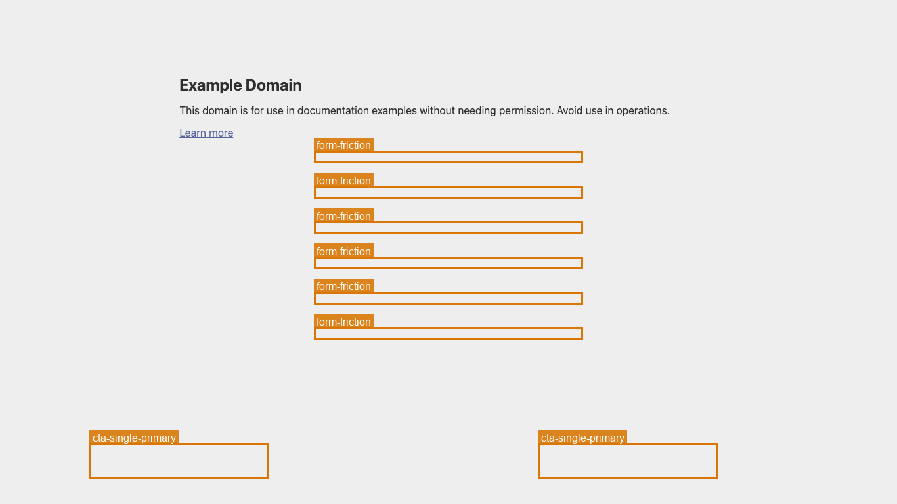

# uxlint

[](https://github.com/kannajune/uxlint/actions/workflows/ci.yml)
[](LICENSE)
[](https://www.python.org/)

**A linter for your landing pages.** Point it at a URL, and it screenshots the
page, *locates* the UX elements with an open-vocabulary vision model, and gives
you a ranked list of conversion-rate (CRO) issues — plus an annotated image
showing exactly where each problem is.



> Each box is a finding, colored by severity. Regenerate with `python examples/demo.py`.

```bash
uxlint audit https://example.com
```

```
  uxlint report for https://example.com
  viewport: desktop   score: 73/100

  [✗] CRITICAL  No primary call-to-action found above the fold
      No clear primary CTA was located in the first screenful.
      → Add one obvious primary action visible without scrolling.

  [!] WARNING   No trust signals near the top
      ...
```

It writes `annotated.png` (boxes drawn on the screenshot) and `report.json`.

---

## Why

Every CRO/UX audit tool today is a paid SaaS or a tag checker. `uxlint` is an
open-source **package** you can run locally or in CI. The magic is
*open-vocabulary localization*: instead of brittle CSS selectors, it asks a
vision model in plain English — "find the primary CTA", "find the form fields",
"find the trust badges" — and reasons about where they are.

## How it works

```
URL ──▶ capture ──▶ locate ──▶ rules ──▶ report
      (Playwright)  (vision)   (CRO)    (png + json)
```

The **locator** is pluggable:

| Backend           | Needs GPU? | Use for                         |
| ----------------- | ---------- | ------------------------------- |
| `mock` (default)  | No         | Trying the pipeline, developing rules |
| `locate-anything` | Yes (ideal) | Real results via [NVIDIA LocateAnything](https://research.nvidia.com/labs/lpr/locate-anything/) |

> The `mock` backend fabricates deterministic boxes so you can see the whole
> tool run with zero setup. Swap to `--backend locate-anything` for real vision.

## Install

```bash
pip install uxlint
playwright install chromium          # one-time browser download

# optional: the real vision backend
pip install "uxlint[model]"
```

## Usage

```bash
uxlint audit https://example.com --viewport mobile -o ./report
uxlint audit https://example.com --backend locate-anything
```

Exit code is non-zero if any **critical** finding is present — drop it into CI
to fail a build when the hero loses its CTA.

### As a library

```python
from uxlint.audit import audit

result = audit("https://example.com", viewport="mobile")
print(result.score)
for f in result.findings:
    print(f.severity, f.title)
```

## The rules (v0.1)

| Rule                 | Severity   | Checks                                            |
| -------------------- | ---------- | ------------------------------------------------- |
| `cta-above-fold`     | critical/warn | A primary CTA exists and sits high on the page |
| `cta-single-primary` | warning    | Not multiple competing primary CTAs               |
| `cta-tap-target`     | warning    | CTA ≥ 44px tall on mobile                          |
| `form-friction`      | warning    | Not too many input fields above the fold          |
| `trust-signals`      | info       | Social proof / badges present near the top        |

Add your own by subclassing `Rule` in `uxlint/rules/` and registering it.

## Roadmap

- [ ] Plug in real LocateAnything output parsing (see `locator/locate_anything.py`)
- [ ] Color-contrast and readability checks
- [ ] HTML report with side-by-side annotated image
- [ ] GitHub Action

## Development

```bash
pip install -e ".[dev]"
pytest          # rule tests run with no browser/model
```

## License

MIT
